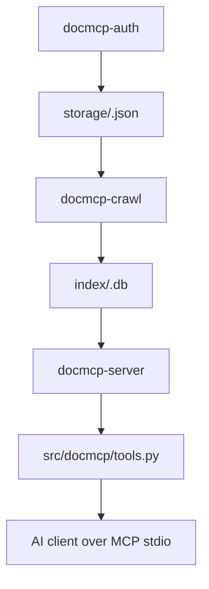

# Overview

## Document Control
- Status: Approved
- Owner: Documentation Maintainers
- Reviewers: Repository maintainers
- Created: 2026-04-24
- Last Updated: 2026-04-25
- Version: v1.1

## Change Log
- 2026-04-25 | v1.1 | Updated architecture references for the docmcp package entry points and moved implementation modules.
- 2026-04-24 | v1.0 | Reformatted the architecture overview to the documentation standard and clarified the runtime flow.

## Purpose
Describe the end-to-end runtime shape of `doc-mcp`: authenticate to a documentation site, crawl and index the pages, then serve search and fetch tools over MCP.

## Scope
- In scope:
  - The main runtime stages and their data flow.
  - The core implementation files that participate in the pipeline.
- Out of scope:
  - Per-site configuration values.
  - CLI usage details that belong in the setup and operations docs.

## Design / Behavior
### Architecture

### Main Components
- `docmcp-auth` starts the browser and saves the authenticated session state.
- `docmcp-crawl` opens the site in Playwright, walks the documentation tree, converts HTML to Markdown, and stores results in SQLite.
- `docmcp-server` starts the MCP server in stdio mode through `src/docmcp/main.py`.
- `src/docmcp/tools.py` exposes the MCP tools used by clients.
- `src/docmcp/config/loader.py` loads `config/sites.yaml` and resolves `${ENV_VAR}` placeholders from `.env` and process env.
- `src/docmcp/index_store.py` manages the SQLite schema, FTS5 index, and page upserts.

### Data Flow
1. The user configures a site in `config/sites.yaml`.
2. The user authenticates once with `docmcp-auth`.
3. The crawler reuses the saved session if it is still valid.
4. Each crawled page is normalized, converted to Markdown, and written to SQLite.
5. The MCP server reads from SQLite and returns search results or page content to AI clients.

### Storage Layout
- Sessions: `storage/<site>.json`
- Indexes: `index/<site>.db`
- Configuration: `config/sites.yaml`
- Local secrets and overrides: `.env`

## Edge Cases
- If authentication expires mid-flow, the crawler stops and asks for re-authentication.
- If `markdownify` is missing, the crawler falls back to plain text extraction.
- If a page redirects to login, the session is treated as invalid.

## References
- [authentication.md](authentication.md)
- [crawling.md](crawling.md)
- [mcp-server.md](mcp-server.md)
- [src/docmcp/main.py](../src/docmcp/main.py)
- [src/docmcp/tools.py](../src/docmcp/tools.py)
- [src/docmcp/config/loader.py](../src/docmcp/config/loader.py)
- [src/docmcp/index_store.py](../src/docmcp/index_store.py)
