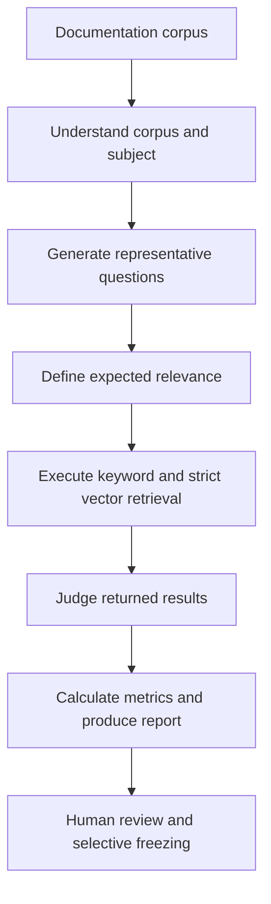

# AI-Assisted Search Relevance Benchmark Concept

## Document Control
- Status: Review
- Owner: Repository maintainers
- Reviewers: Repository maintainers
- Created: 2026-09-13
- Last Updated: 2026-09-13
- Version: v0.1
- Related Tickets: [GitHub issue #28](https://github.com/veep2012/doc_mcp/issues/28)

## Change Log
- 2026-09-13 | v0.1 | Added the proposed artifact-driven relevance benchmark concept.

## Purpose
Describe the proposed high-level workflow for creating, reviewing, reusing, and executing a reproducible search relevance benchmark.

## Scope
- In scope:
  - AI-assisted creation of benchmark definitions and relevance judgments.
  - Human review, revision, and freezing of generated artifacts.
  - Reuse and invalidation of versioned artifacts across benchmark runs.
  - Keyword, strict-vector, and embedding-model relevance comparisons.
- Out of scope:
  - Implementation structure, technology selection, and API details.
  - Search latency, throughput, resource use, and performance benchmarking.
  - Changes to production ranking, chunking, vectorization, or model selection.

## Design / Behavior
The benchmark is a linear, artifact-driven pipeline. Each stage consumes versioned input artifacts and produces a structured or semi-structured output artifact.

### Initial Run
The initial run should proceed through the complete pipeline without requiring approval between stages. Draft outputs may feed later stages so that reviewers can inspect the complete benchmark and report before deciding what to change or freeze.

### Human Review
After the pipeline completes, a reviewer may accept, edit, replace, regenerate, or freeze any generated artifact. Human changes must create new revisions; previous revisions must remain available and must not be silently overwritten.

The main reviewable artifacts are:

- Corpus understanding.
- Representative question set.
- Expected-relevance baseline.
- Relevance judgments and human overrides.
- Final relevance report.

### Reuse and Invalidation
Before executing a stage, the pipeline should look for a frozen output produced from the same input revisions and relevant configuration.

- A matching frozen artifact should be reused and its stage skipped.
- A draft artifact may support the current end-to-end draft run but should not be treated as reusable approval for later runs.
- A changed input must make dependent artifacts outdated.
- Outdated and superseded artifacts must remain available for traceability.
- Only the affected stage and its descendants should be regenerated.

This produces the following operating principle:

> Run the complete pipeline eagerly, review the result retrospectively, freeze trusted artifacts selectively, and regenerate only outputs invalidated by later changes.

### Retrieval and Evaluation
Keyword and vector retrieval must use the same frozen questions and result limit. Vector retrieval must be strict: missing, stale, incompatible, empty, unreadable, or unavailable vector prerequisites must be reported explicitly and must never be represented by keyword fallback.

AI-assisted judgments may classify result relevance and provide a rationale. Humans may override individual judgments. Final metrics should be calculated deterministically from the preserved results and effective judgments.

### Run Artifacts
Every execution must create a distinct, preserved artifact set containing:

- Input artifact revisions.
- Corpus and search configuration identity.
- Keyword and vector retrieval results.
- Embedding-model and vector-sidecar metadata.
- Generated judgments and human overrides.
- Relevance metrics and the final report.

Embedding-model runs may be compared only when they use the same frozen corpus, questions, expected relevance, result limit, and scoring method.

## Edge Cases
- If a human changes an upstream artifact after a complete run, prior downstream artifacts remain historical but become outdated for future runs.
- If only one judgment changes, the workflow should recalculate affected metrics and reports without regenerating unrelated definition artifacts.
- If no frozen artifact matches the current inputs, the stage must produce a new draft rather than reuse an incompatible revision.
- If strict vector retrieval is unavailable, the run may continue for diagnostics but must not claim a valid keyword-versus-vector comparison.

## References
- [GitHub issue #28](https://github.com/veep2012/doc_mcp/issues/28)
- [Configuration](configuration.md)
- [MCP Server](mcp-server.md)
- [SQLite Vector Queries](sqlite_vector_queries.md)
- [Testing Framework Guide](test_scenarios/testing_framework_guide.md)

