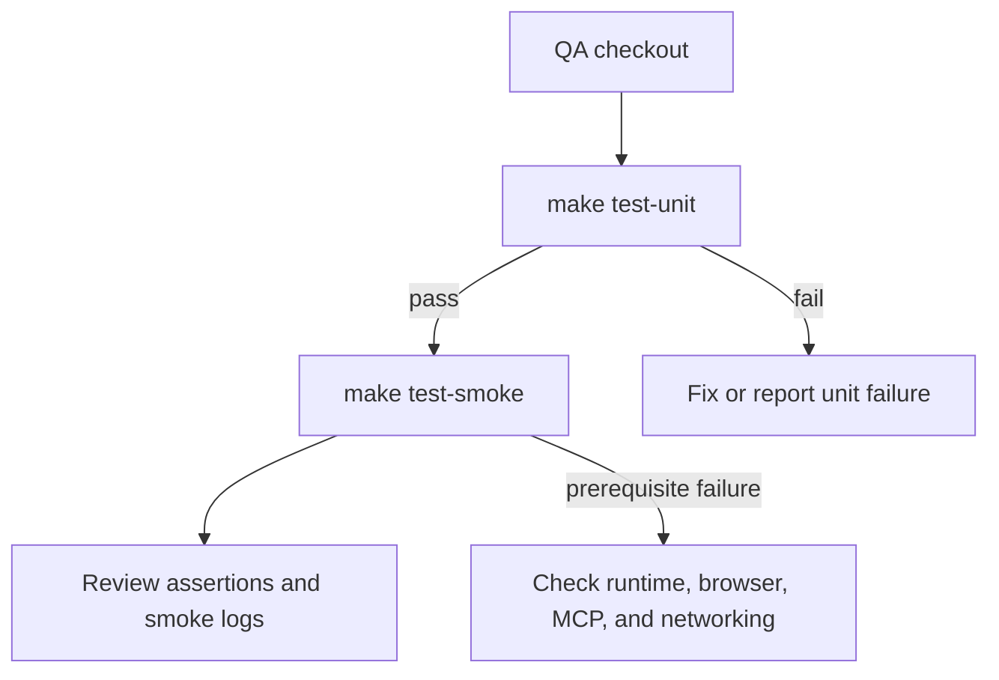

# External QA Test Framework Guide

## Document Control
- Status: Review
- Owner: Documentation Maintainers
- Reviewers: Repository maintainers and external QA
- Created: 2026-07-26
- Last Updated: 2026-08-29
- Version: v0.2
- Related Documents: [Testing Framework Test Scenarios](testing_framework_test_scenarios.md)

## Change Log
- 2026-08-29 | v0.2 | Updated MCP smoke coverage guidance for resource capability discovery, valid resource reads, and rejected malformed, missing, and out-of-scope page reads.
- 2026-07-26 | v0.1 | Added the external-QA guide for the pytest framework, repository layout, commands, shared helpers, and smoke-test diagnostics.

## Purpose
Explain how external QA engineers install, run, diagnose, and extend the repository test framework. This guide describes the folders, test entry points, markers, shared support modules, generated smoke artifacts, and expected results.

## Scope
- In scope:
  - Running unit, performance, and end-to-end smoke tests.
  - Understanding the test and runtime folder layout.
  - Using the `test_support` and `smoke_support` helper modules.
  - Collecting logs and reporting failures.
- Out of scope:
  - Product-specific manual test steps.
  - Site authentication walkthroughs.
  - Deployment or CI administration.

## Audience
- External QA engineers validating a checkout.
- QA engineers adding regression or smoke coverage.
- Maintainers reviewing test failures and artifacts.

## Definitions
- **Unit/default test**: A fast pytest test that runs without the `smoke` marker.
- **Smoke test**: An end-to-end pytest test marked `smoke`; it may start a container, browser, or MCP stdio server.
- **Runtime root**: The directory selected by `DOC_MCP_HOME` for config, Playwright storage, indexes, and environment files.
- **Smoke artifact root**: A temporary directory under `.local/smoke/` created for one smoke test.
- **Optional dependency gate**: A shared import check that skips only the affected test when MCP or Playwright is unavailable and prints the install command.

## Background / Context
The framework uses pytest and Make. Plain pytest intentionally excludes smoke tests through `pytest.ini`, so a normal feedback loop does not require Podman/Docker, a reachable site, or the MCP stdio client. `make test` is the canonical full validation command: it runs the default suite first and starts smoke coverage only if that succeeds.

## Requirements
### Functional Requirements
- FR-1: QA can run the default suite with one command.
- FR-2: QA can run smoke coverage independently when container and browser prerequisites are available.
- FR-3: Test failures identify the command, runtime workspace, and relevant log file where applicable.
- FR-4: Tests remain isolated from checked-in `config/`, `storage/`, and `index/` data.
- FR-5: Missing optional dependencies produce actionable skips or prerequisite failures.

### Non-Functional Requirements
- NFR-1: Use the active virtual-environment interpreter for pytest and Playwright.
- NFR-2: Do not commit `.local/smoke/` artifacts, credentials, session files, or generated indexes.
- NFR-3: Keep test names and marker usage descriptive enough for targeted QA runs.

## Design / Behavior
### Repository Layout

| Path | QA purpose |
| --- | --- |
| `tests/` | Default pytest suite for application behavior and framework contracts. |
| `tests/smoke/` | End-to-end tests that require the `smoke` marker. |
| `tests/conftest.py` | Session-wide pytest fixtures; it replaces the external embedding backend with a deterministic fake for fast, repeatable tests. |
| `tests/support/test_support.py` | Minimal shared dependency and repository-path helpers for the test suite. |
| `tests/support/smoke_support.py` | Smoke-only helpers for prerequisites, subprocesses, containers, runtime isolation, context output, and MCP stdio calls. |
| `src/docmcp/` | Application implementation under test. |
| `src/main.py`, `auth_cli.py`, `crawl_cli.py`, `vectorize_cli.py` | Repository-level CLI entry scripts used by smoke tests and manual verification. |
| `config/sites.yaml.example` | Example site configuration; it is not a smoke-test workspace. |
| `documentation/test_scenarios/` | Manual and automated test scenario documentation. |
| `pytest.ini` | Test discovery, `src` import path, default marker selection, and async mode. |
| `Makefile` | Supported test and environment commands. |
| `.local/smoke/` | Temporary smoke runtime roots and logs; cleanup is registered at process exit. |

### Test Selection

| Command | Use | Prerequisites |
| --- | --- | --- |
| `make test-unit` | Run the default non-smoke suite. | `.venv` with development dependencies. |
| `make test-smoke` | Run all smoke tests. | `.venv`, Playwright browser, Podman or Docker, container networking, and MCP. |
| `make test` | Run unit tests, then smoke tests. | All prerequisites above. |
| `.venv/bin/python -m pytest` | Direct default pytest run; smoke tests are deselected by `pytest.ini`. | `.venv` recommended. |
| `.venv/bin/python -m pytest -o addopts= -m smoke` | Run only smoke-marked tests directly. | Smoke prerequisites. |
| `.venv/bin/python -m pytest tests/test_tools.py -q` | Run one test module. | Dependencies used by that module. |
| `.venv/bin/python -m pytest tests/test_tools.py -k search_docs -q` | Run matching tests by name. | Dependencies used by matching tests. |

`make test-smoke` defaults to `CONTAINER_BIN=podman`. Use `CONTAINER_BIN=docker make test-smoke` when Docker is the available runtime or Podman networking is unavailable. To create the expected environment first, run `make local-venv`; the target installs development dependencies and the Chromium browser.

### Using Pytest Manually

Run pytest through the active virtual environment so the test runner and installed packages use the same interpreter. The examples below use `.venv/bin/python`; on Windows use `.venv\\Scripts\\python.exe`.

```bash
# Run the default suite; smoke tests are deselected by pytest.ini.
.venv/bin/python -m pytest

# Show the collected tests without running them.
.venv/bin/python -m pytest --collect-only -q

# Run one module, one test, or tests whose names match an expression.
.venv/bin/python -m pytest tests/test_tools.py -q
.venv/bin/python -m pytest tests/test_tools.py::test_mcp_tools_return_site_pages_search_and_fetch -q
.venv/bin/python -m pytest -k 'search_docs and not vector' -q

# Run smoke tests explicitly. Clear pytest.ini addopts first.
.venv/bin/python -m pytest -o addopts= -m smoke -q

# Run one smoke category.
.venv/bin/python -m pytest -o addopts= -m crawl_smoke -q
.venv/bin/python -m pytest -o addopts= -m mcp_smoke -q
```

Useful pytest options for manual investigation:

| Option | Effect |
| --- | --- |
| `-q` / `-v` | Reduce or increase test-name output. |
| `-x` | Stop after the first failure. |
| `--maxfail=3` | Stop after a chosen number of failures. |
| `-s` | Disable output capture so diagnostic `print` calls appear immediately. |
| `--tb=short` or `--tb=long` | Change traceback detail. |
| `--lf` | Rerun tests that failed in the previous pytest session. |
| `--ff` | Run previously failing tests first, then the remaining tests. |
| `-ra` | Show the summary for skips, failures, and other non-passing outcomes; already enabled by `pytest.ini`. |
| `-m 'not smoke'` | Exclude smoke tests explicitly. |
| `-m 'smoke and crawl_smoke'` | Select crawl smoke tests only when used with `-o addopts=`. |

Examples for a failure investigation:

```bash
# Re-run one failing test with full output and a detailed traceback.
.venv/bin/python -m pytest tests/test_crawl_cli.py::test_name -s -vv --tb=long

# Re-run the last failures, stopping after three.
.venv/bin/python -m pytest --lf --maxfail=3 -q

# Inspect collection when an optional dependency is not installed.
PYTEST_DISABLE_PLUGIN_AUTOLOAD=1 .venv/bin/python -m pytest --collect-only -q \
  tests/test_playwright_settings.py tests/smoke/test_mcp_smoke.py
```

Collection can succeed even when Playwright or MCP is unavailable. The affected tests are skipped through `require_test_dependency`; the output should include the missing dependency and `python -m pip install -r requirements-dev.txt`. A collection traceback for an unavailable optional dependency indicates a framework regression and should be reported.

### Test Execution Flow


### Test Categories
- `tests/test_index_store.py`: SQLite page persistence, updates, counts, listing, and search.
- `tests/test_config_loader.py`: runtime-relative paths, `.env` handling, YAML validation, and site settings.
- `tests/test_crawl_cli.py`: URL normalization, filtering, link discovery, HTML/PDF extraction, redirects, targeted reindexing, and crawl orchestration.
- `tests/test_tools.py`: MCP tool responses, keyword/vector/hybrid search behavior, fallback handling, and error responses.
- `tests/test_auth_cli.py` and `tests/test_playwright_settings.py`: CLI validation, authentication settings, and browser prerequisite handling.
- `tests/test_vector_index.py` and `tests/test_performance_guards.py`: vector index behavior and lightweight performance guards. Performance tests use the `performance` marker but remain part of default pytest selection.
- `tests/smoke/test_crawl_smoke.py`: serves a temporary static site in a container, crawls it, and verifies indexed pages.
- `tests/smoke/test_mcp_smoke.py`: creates a prepared temporary SQLite index, starts the MCP server over stdio, and verifies `search_docs`.
- `tests/test_smoke_support.py`: protects the framework itself, including Make ordering, marker defaults, optional dependency gates, and actionable prerequisite messages.

## Shared Support Modules
### `test_support`
This test-only helper module contains lightweight shared helpers. Pytest adds `tests/support/` to its import path, so tests import it as a top-level module.

- `REPO_ROOT`: absolute `Path` to the repository root. Use it for subprocess working directories and repository files.
- `TEST_DEPENDENCY_INSTALL_COMMAND`: canonical remediation command, `python -m pip install -r requirements-dev.txt`.
- `require_test_dependency(module_name, dependency_name, purpose)`: calls `pytest.importorskip`. If an optional module is unavailable, the test is skipped with the dependency name, purpose, and installation command.

Use this module in tests that need a dependency only for a specific test. Do not duplicate import-skip messages in individual test files.

### `smoke_support`
Smoke tests should reuse these helpers so that failures and cleanup are consistent:

| Helper | Behavior |
| --- | --- |
| `require_executable(command, guidance)` | Fails the test with remediation when Podman, Docker, or another executable is missing. |
| `require_existing_path(path, guidance)` | Fails with remediation when a required prepared file is absent. |
| `run_checked(args, ...)` | Runs a subprocess with captured output, timeout handling, optional log persistence, and readable pytest failures. |
| `smoke_artifact_root(test_name)` | Creates an isolated temporary workspace at `.local/smoke/<test-name>-*` with `config`, `storage`, `index`, and `logs` directories. |
| `smoke_log_file(runtime_root, filename)` | Returns a path under the workspace `logs/` directory. |
| `print_smoke_context(title, lines)` | Prints `[smoke]`-prefixed site, runtime, index, and log context to the test output. |
| `smoke_env(runtime_root)` | Builds the environment with `DOC_MCP_HOME`, `CONFIG_FILE=config/sites.yaml`, repository `PYTHONPATH`, and `MCP_LOG_LEVEL=INFO`. |
| `running_static_site(site_root)` | Starts a disposable nginx container, waits for HTTP readiness, yields its local URL, and stops the container during cleanup. |
| `call_search_docs(runtime_root, site_name, query, errlog=...)` | Starts `src.main` as an MCP stdio server in the isolated runtime and returns the first text content block from `search_docs`. |

`run_checked` writes subprocess output to the supplied log path. On timeout it recommends checking rootless networking or switching from Podman to Docker. On non-zero exit it includes stdout and stderr in the pytest failure.

## Smoke Runtime and Artifacts
Each smoke test creates its own temporary runtime root. The test environment is intentionally separate from the repository's normal runtime data:

```text
.local/smoke/<test-name>-<temporary-id>/
├── config/sites.yaml
├── index/*.db
├── logs/*.log
├── site/                 # crawl smoke fixture content
└── storage/              # reserved for session state when needed
```

The root is cleaned up at Python process exit through `atexit`. While a test process is running, use the printed `runtime_root` and `log_file` paths to inspect evidence. Preserve relevant log output in the QA report before rerunning if the next run may replace the evidence.

Smoke configuration normally uses paths relative to `DOC_MCP_HOME`. The crawl smoke test sets `auth_required: false`, uses a temporary HTTP site, and writes `index/smoke.db`. The MCP smoke test writes `index/prepared.db`, verifies the initialized `resources` capability and site/page resource templates, reads a valid page resource, rejects malformed, missing, and out-of-scope resource reads, and validates JSON fields including `mode`, hit counts, title, URL, resource URI, and result source.

### Where to See E2E Results and Logs

- The pytest process prints the pass/fail summary and assertion traceback in the terminal. Use `-s` to show live diagnostic output instead of pytest's normal output capture.
- Smoke tests print a `[smoke]` context block containing the test type, site, runtime root, index path, and log path. The exact temporary path from this block is the source of truth for the current run.
- Crawl smoke writes subprocess stdout and stderr to `<runtime_root>/logs/crawl.log`.
- MCP smoke writes the MCP server stderr stream to `<runtime_root>/logs/mcp.log`.
- Generated databases are under `<runtime_root>/index/`; they are useful for local inspection while the pytest process is alive but are not test reports.
- There is no permanent JUnit or HTML report configured by default. Redirect terminal output when a durable text record is needed, for example: `make test-smoke 2>&1 | tee e2e-test-run.log`.

Because `smoke_support` registers cleanup with `atexit`, the temporary smoke directory is normally removed when pytest exits. Copy the needed log or capture the terminal output before ending the process. If a run is interrupted, a leftover `.local/smoke/` directory may remain and can be inspected after the fact.

### Canonical Helper Import Contract

Use these imports in test and smoke files:

```python
from test_support import REPO_ROOT, require_test_dependency
from smoke_support import run_checked, smoke_artifact_root
```

Do not import these helpers through `tests.*`, for example `from tests.test_support ...` or `from tests.smoke_support ...`. The helpers are intentionally exposed as top-level test modules so they remain usable when the `tests` package is unavailable or collection uses a different import mode.

## QA Workflow
1. Confirm the checkout is clean enough to test and that Python 3.11 or newer is available.
2. Create or activate `.venv`, then install `requirements-dev.txt` and the configured Playwright browser.
3. Run `make test-unit` and record the pytest summary.
4. If end-to-end validation is in scope, verify `podman info` or `docker info`, then run `make test-smoke`.
5. For a failure, rerun the smallest relevant module or marker, capture the command, full failure, `[smoke]` context, and log contents, and report the environment details.
6. Before handing off, confirm no credentials or generated `.local/smoke/` files are included in the report or commit.

Useful environment details are the operating system, Python version, pytest version, container runtime and version, `CONTAINER_BIN`, Playwright browser, and whether the failure reproduces with Docker instead of Podman.

## Troubleshooting
- **Smoke tests are deselected**: plain `pytest` is expected to exclude them. Run `make test-smoke` or `python -m pytest -o addopts= -m smoke`.
- **MCP import skip**: install the development requirements with `python -m pip install -r requirements-dev.txt`.
- **Missing browser**: install the browser named by the site's Playwright setting, for example `python -m playwright install chromium`.
- **Missing Podman/Docker**: install a supported container runtime or treat smoke coverage as unavailable; default tests do not require one.
- **Container starts but URL is unreachable**: check rootless networking, mapped ports, container machine/socket health, and retry with `CONTAINER_BIN=docker`.
- **Unexpected repository data in a smoke result**: inspect `DOC_MCP_HOME`, `CONFIG_FILE`, and the printed runtime root. Smoke tests should use `.local/smoke/` paths.
- **MCP smoke search mismatch**: inspect `logs/mcp.log`, verify the temporary config points to `index/prepared.db`, and confirm the query matches the inserted page content.

## Edge Cases
- A missing optional dependency should skip the affected test, not prevent collection of unrelated tests.
- `pytest.ini` applies `addopts = -ra -m "not smoke"`; explicit smoke runs must override `addopts`.
- A smoke test can fail because of infrastructure even when application assertions are correct. Classify prerequisite, environment, command, and assertion failures separately.
- Smoke artifact cleanup occurs at process exit; an interrupted process may leave `.local/smoke/` data that can be removed after evidence is collected.

## Testing Strategy
- Framework documentation changes: run `python scripts/check_documentation_changelog_duplicates.py` and inspect the rendered Markdown links.
- Test changes: run the smallest affected pytest module, then `make test-unit`.
- Smoke changes: run the affected marker or smoke module, then the complete `make test-smoke` suite when prerequisites permit.

## References
- [Testing Framework Test Scenarios](testing_framework_test_scenarios.md)
- [Manual Test Scenarios](manual-test-scenarios.md)
- [Makefile](../../Makefile)
- [pytest.ini](../../pytest.ini)
- [Test support helpers](../../tests/support/test_support.py)
- [Smoke support helpers](../../tests/support/smoke_support.py)
- [Smoke crawl test](../../tests/smoke/test_crawl_smoke.py)
- [Smoke MCP test](../../tests/smoke/test_mcp_smoke.py)
- [Development requirements](../../requirements-dev.txt)
